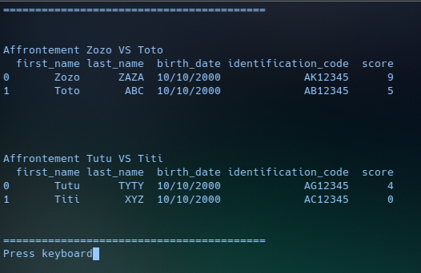
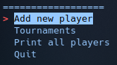

# Club d'échecs


Project 4 Développez un programme logiciel en Python




## Objective:
Dans les projets précédents, vous avez déjà découvert les bases de la programmation en Python ainsi que les clés de la gestion du projet du développement.


Il est temps de passer à la suite !

Vous allez monter en compétences en programmation en Python


Dans ce projet, vous allez écrire du code Python robuste en respectant les standards de la PEP 8. Vous utiliserez la programmation orientée objet pour développer des programmes Python efficaces et plus structurés. Vous appliquerez le design pattern MVC pour organiser votre code de manière plus fonctionnelle et maintenable.


Votre code sera la vitrine de vos compétences en développement logiciel, prouvant votre capacité à répondre à des besoins complexes et à travailler selon des standards professionnels élevés.


Votre mission consiste à aider vos amis à organiser des tournois d'échecs en développant un programme logiciel en Python. Vous structurerez ce programme en utilisant la programmation orientée objet et le design pattern MVC. Enfin, vous vous assurerez que votre code est conforme à la PEP 8 en utilisant flake8 pour analyser et rapporter les écarts.

## Requirements

### Venv
-for windows:
```python
c:\>python -m venv c:\path\to\Projet_4_Tournoi_d_echecs
```
-for linux:
```python
python -m venv /path/to/Projet_4_Tournoi_d_echecs
```

### Souce activate
-for windows:
```python
c:\>path\to\Projet_4_Tournoi_d_echecs\Scripts\activate.bat
```
-for linux:
```python
source /path/to/Projet_4_Tournoi_d_echecs/bin/activate
```

### install requirements
```python
pip install -r requirements.txt
```
if you are this error (i use manjaro):
```python
error: externally-managed-environment

× This environment is externally managed
╰─> To install Python packages system-wide, try "pacman -S
    python-xyz", where xyz is the package you are trying to
    install.

```

try with this command:
```python
pip install -r requirements.txt --break-system-packages
```
## Flake8
```bash

#générer rapport flake8
flake8 --format=html --htmldir=flake8-rapport
```
## Usage
lancer python.py
```bash
python python.py
```
### Menu principal


Depuis ce menu vous pouvez créer un nouveau joueur, gérer les tournois, afficher tout les joueurs créer et tout simplement quitter le programme si vous en avez assez :)

